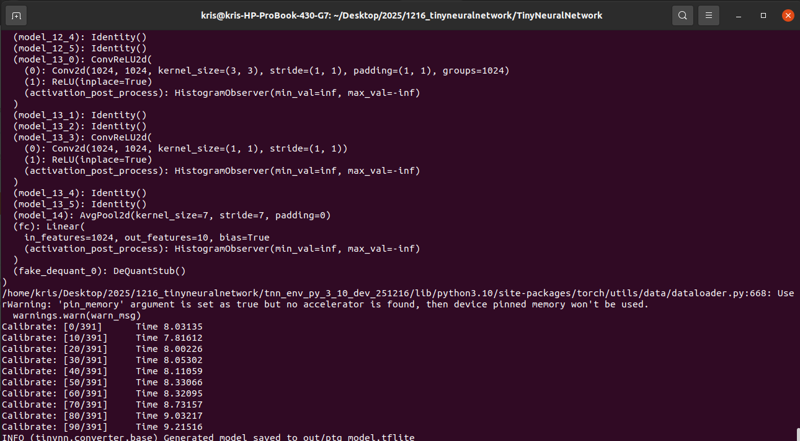
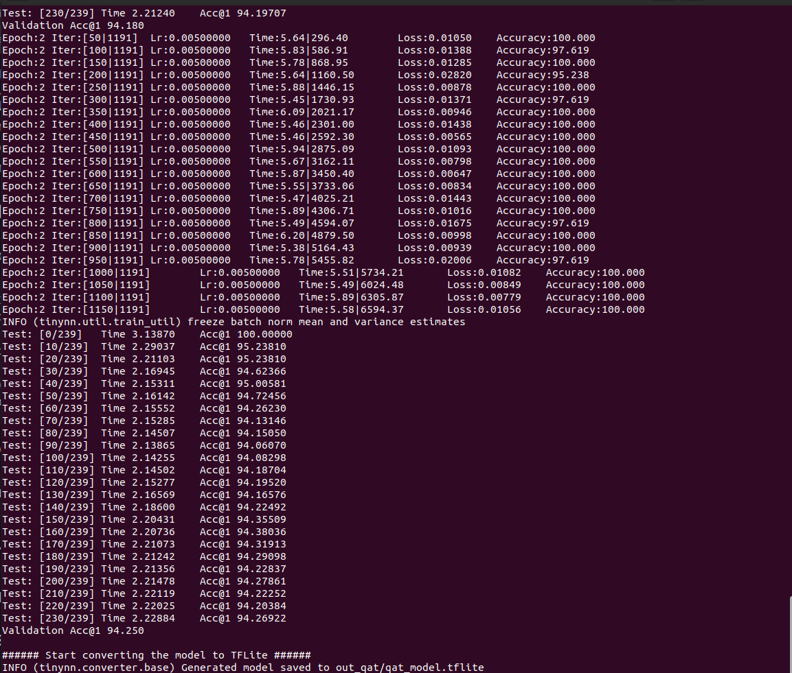
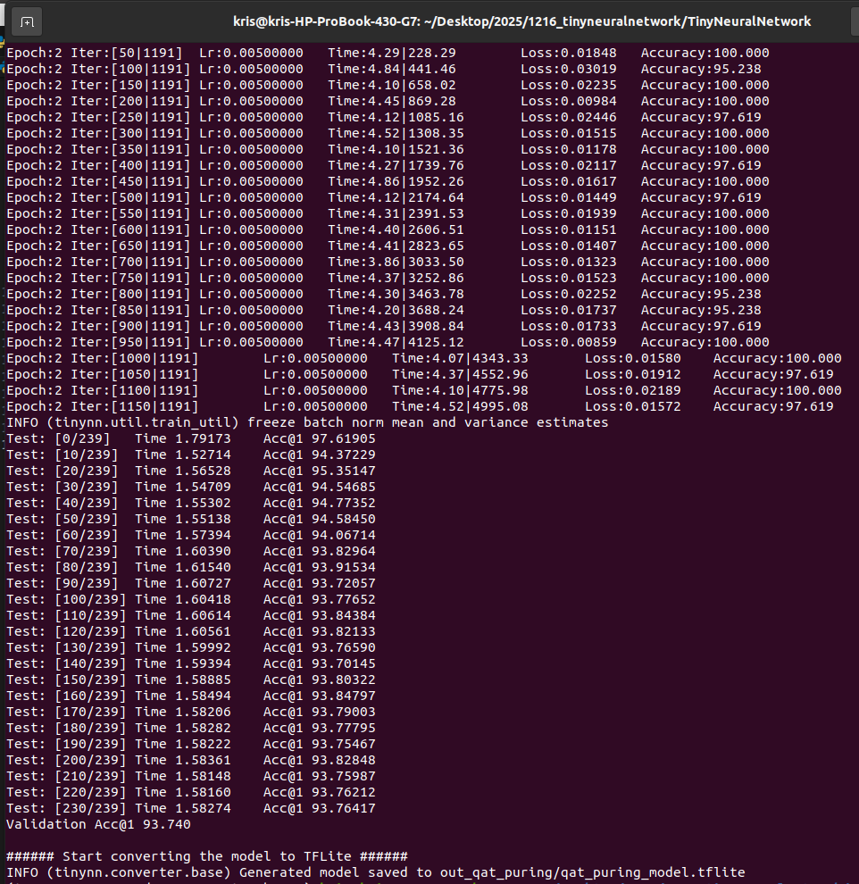
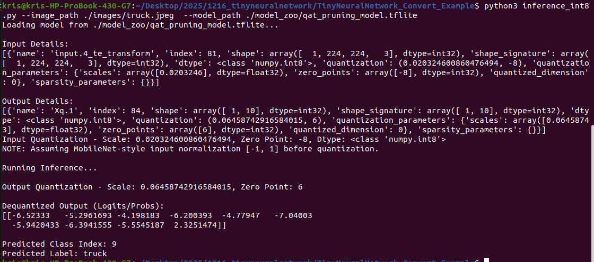
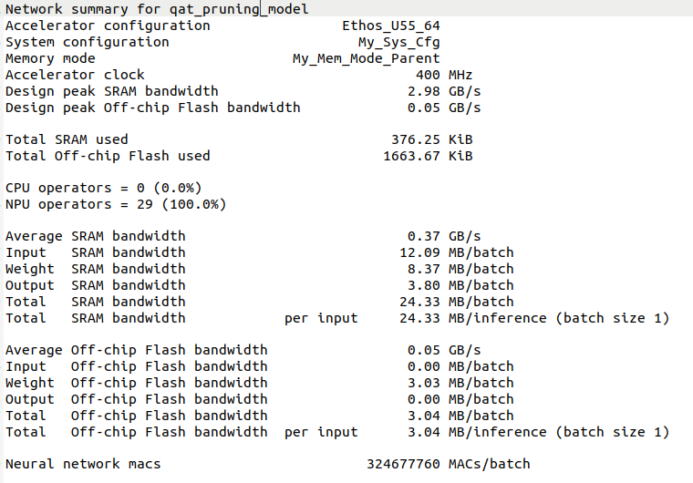

# TinyNeuralNetwork_Convert_Example
The repository demonstrates using the TinyNeuralNetwork to convert Pytorch model to tflite and run on Himax WE2 chip.
# Installation
- The package has been tested in Ubuntu 20.04 LTS environment.
- Python 3.10
- torch 2.5.0
- torchvision 0.20.0

```
# install python3.10-dev first
sudo apt install python3.10-dev
```
```
git clone --recursive https://github.com/HimaxWiseEyePlus/TinyNeuralNetwork_Convert_Example
cd TinyNeuralNetwork_Convert_Example
# create python 3.10 venv
python3.10 -m venv --without-pip  tnn_env_py_3_10_dev
wget https://bootstrap.pypa.io/get-pip.py
source './tnn_env_py_3_10_dev/bin/activate' 
which python
python --version
which pip
python get-pip.py
```
- Go to submodule `TinyNeuralNetwork` folder
```
cd TinyNeuralNetwork
# install torch
pip install torch==2.5.0
pip install -r requirements.txt
pip install torchvision==0.20.0
pip install ethos-u-vela
pip install tensorflow
# download himax vela config ini
wget https://raw.githubusercontent.com/HimaxWiseEyePlus/ML_FVP_EVALUATION/main/vela/himax_vela.ini
cp ../ptq_example.py ./
cp ../qat_example.py ./
cp ../qat_pruning_example.py ./
cp ../inference_int8.py ./

```
# Convert example
There are three example. 
- PTQ (Post-Training Quantization) example, it will generate `out/ptq_model.tflite`
```
# make sure you are under `TinyNeuralNetwork` folder
python3 ptq_example.py --data-path ./data --workers 2 --batch-size 64
#python3 ptq_example.py --data-path ./data
```


- QAT (Quantization-Aware Training) example, it will generate `out_qat/qat_model.tflite`
```
# make sure you are under `TinyNeuralNetwork` folder
python3 qat_example.py --data-path ./data --workers 2 --batch-size 64
#python3 qat_example.py --data-path ./data
```


- Pruning and QAT example, it will generate `out_qat_pruning/qat_pruning_model.tflite`
```
# make sure you are under `TinyNeuralNetwork` folder
python3 qat_pruning_example.py --data-path ./data --workers 2 --batch-size 64
#python3 qat_pruning_example.py --data-path ./data
```



# Test int8 tflite model on PC by python
```
python3 inference_int8.py --image_path ../images/truck.jpeg  --model_path ../model_zoo/qat_pruning_model.tflite
```


# Pass Vela compiler to vela model which can run on WE2 U55 NPU
- Please use the latest version about ethos-u-vela for supporting more operator at U55 NPU.
- Recommand environment: `Python 3.12`, `ethos-u-vela>=4.5.0`
- You can use the Colab to create the environment simply.
The tensor arena used at mobilenet is big. You can add vela CLI `--optimise Size` to optimise SRAM size.
- [int8 tflite model path]: you should put your own int8 tflite path name at here
```
vela --accelerator-config ethos-u55-64 --config ../himax_vela.ini --system-config My_Sys_Cfg --memory-mode My_Mem_Mode_Parent --optimise Size --output-dir ./ ./[int8 tflite model path]

#vela --accelerator-config ethos-u55-64 --config ../himax_vela.ini --system-config My_Sys_Cfg --memory-mode My_Mem_Mode_Parent --optimise Size --output-dir ../model_zoo ../model_zoo/qat_pruning_model.tflite
```


# Run converted tflite on WE2
- You can reference [tflm_mb_cls of Seeed_Grove_Vision_AI_Module_V2](https://github.com/HimaxWiseEyePlus/Seeed_Grove_Vision_AI_Module_V2/tree/main/EPII_CM55M_APP_S/app/scenario_app/tflm_mb_cls)
